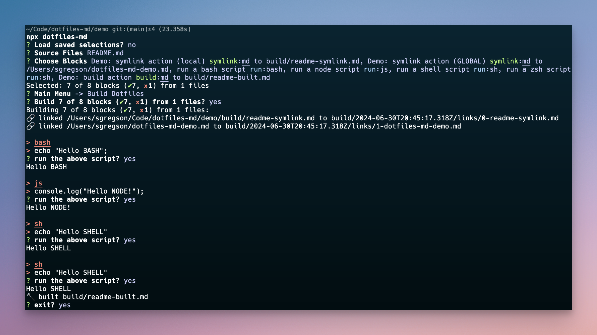

<details><summary><sup><sub>banner image source</sub></sup></summary>
  
  ```html title="logo" disable=true
  <div style="height:3em;aspect-ratio: 6/1;font-size:3.6rem;font-weight:bold;background:linear-gradient(-0.075turn,#3f87a6,#ebf8e1,#f69d3c);color:white;text-shadow:1px 1px 3px black;display:grid;place-items:center;margin:2em 0">
    <div>
      <code style="background-color: rgba(0,0,0,.2);padding:.2em .5em;border-radius:.25em">*.md</code>
      →
      <code style="background-color: rgba(0,0,0,.2);padding:.2em .5em;border-radius:.25em">~/.*</code>
    </div>
  </div>
  ```

</details>

[](https://opensource.org/licenses/)

# dotfiles-md

Maintain your system configuration as a collection of installable markdown blocks

## Usage

> _**Requires:** node.js_. See [contributing] for instructions on installing a local copy

Simply navigate to your folder of markdown and then run the interactive CLI:

```sh title="run the program" disabled=true
$ npx dotfiles-md
```



Or if you have a dotfile ready-to-go, invoke it with:

```sh title="invoke a dotfile" disabled=true
$ npx dotfiles-md --auto DOTFILE.md
```

[contributing]: #contributing

### CLI Commands

_run the `help` command to view help pages_

```sh disabled=true
$ npx dotfiles-md --help
```

## How to write Dotfiles in markdown

> Consult [the included demo](./demo/README.md), which may be easier to understand than the specification below.

**Code block metadata**

Each codeblock is created with three backticks (`) or tildes (~) and assigned a **space-delimited** collection of metadata:

````md
```<lang> [filePath] [...options]
[contents]
```
````

_this should generally be compatible with other documentation systems._

The **`<lang>` directive** is the usual markdown code block langauge format. In addition to useful syntax highlighting, this language will determine how to run imperative settings defined with `action=run` (eg. executing scripts).

A **`[filePath]` option** may be provided in order to direct the output of the code block to a file. It **must not** contain an equals sign `=`.

The **`[...options]` array** is a space-delimited list of `key=value` directives defining how the CLI should act on this code block. Values must be quoted if they contain spaces (eg. `title="a fancy title"`).

The **`[contents]`** of the codeblock are acted on according to the options list, particularly the "action" flag.

**Codeblock Options and Actions**

- `action` defines what dotfiles-md will do with the block contents:
  - `=build`: build the file to `[filePath]`
  - `=run`: run this code block according to the file syntax (js: node, sh, bash, zsh)
  - `=symlink`: find-replace patterns (`%...`) in the codeblock and symlink the result (from `/build`) to `[filePath]`
  - `=section`: use the contents of the code block as a section divider in the CLI
- `disabled=<string>`: prevent a block code block from being runnable. The `<string>` is displayed in the UI.
- `title=<string>` a title for the code block to appear in the CLI. `<string>` must be quoted if it contains spaces.
- `when` defines the availability of this codeblock
  - `=os.darwin`: the block will only run on MacOS platforms
  - `=os.win32`: the block will only run on Windows platforms

### Using private `.env` data

If the directory you run `dotfiles-md` from includes a `.env` file, it will be used as a source for replacements in your dotfiles. Prefix your environment variables with `%` in your dotfiles source as in:

- given: an `.env` file containing `S3_BUCKET=my-fancy-bucket`
- when: dotfiles-md encounters a dotfile containing `%S3_BUCKET`
- then: dotfiles will replace that string with `my-fancy-bucket`

## Contributing

Contributions are always welcome!

See `CONTRIBUTING.md` for ways to get started.

Please adhere to a reasonable `code of conduct`.

### Install or Run Locally

```sh action=run title="install and run dotfiles-md" disable=true
# Clone the project
git clone git@github.com:sgregson/dotfiles-md.git
# Go to the project directory
cd dotfiles-md
# Install dependencies
yarn
# Run the interactive CLI
npx dotfiles-md --help
```

## Roadmap

- [x] implement `when=<conditions>` (v0.3.0)
- [x] implement `action=run` (v0.4.6) for imperative settings
- [x] implement `action=section` for block labelling (v0.6.0)
- [x] implement find-replace from `.env` files (v0.7.0)
  - (idea) create sections from nearest doc heading. not sure this is actually more useful than current, but it saves some manual work
- (idea) Update & Improve Interface UI: 2-panel layout for navigation and show a codeblock
- (idea) Generate diff when file a exists instead of the current backup flow

## FAQ

#### Why markdown files?

Specifically, **literate markdown**. IMHO dotfiles (or configuration in general) should be organized in a way that makes sense to you for fast recall and organization. From there you can choose whether to manipulate your `$PATH` or direct them to known defaults (like `~/.gitconfig` vs `!/.config/git/config`).

I also really liked the topic-centric approach of other dotfiles managers (like [holman/dotfiles](https://github.com/holman/dotfiles)) but found I need to give myself WAY more context on the operations than code comments since I update them so infrequently.

#### Why an interactive CLI?

All my old dotfiles systems relied on either a "bag of scripts" folder or someone else's CLI. I loved using [kody](https://github.com/jh3y/kody) for a long time, but updating the dotfiles became difficult as my config grew stale.

#### Why the repo structure?

- `demo/`: A functional demo folder of dotfiles. see demo/README.md
- `dotfiles/`: My actual, personal, dotfiles. Use for inspiration or whatever
- `src/`: the CLI script codebase
