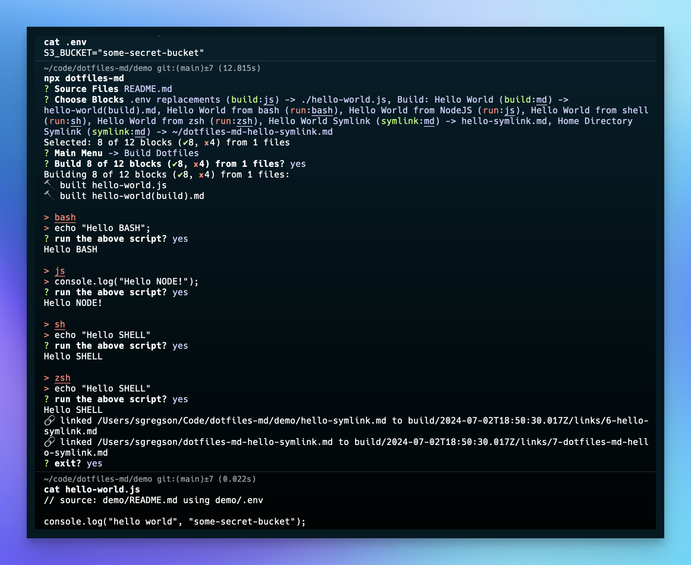

# Dotfiles Demo
```txt action=section
A Dotfiles Demo
```

> A functional demo of markdown-managed dotfiles.

```md title="demo contents" disabled=true
- `.env` (optional) set key-value pairs for replacement
- `**/*.md` dotfiles stored as markdown
```

## Usage

```sh
npx dotfiles-md --demo
```



## The dotfiles blocks
> **tip**: View the raw markdown file to see the metadata on each codeblock

A codeblock without an `action=*` annotation does nothing and won't appear in the CLI

```md
_sometimes you don't want to run a code block_
```

### Replacements from `.env` content

All blocks support replacements when they're read from your own `.env` file

```js ./hello-world.js action=build title=".env replacements"
// source: demo/README.md using demo/.env

console.log("hello world", "%S3_BUCKET");

```


### Demo: Build Actions

```md action=section
# Build
```

The basic build action converts a block of code into a file.


```md hello-world(build).md action=build title="Build: Hello World"
> source: `demo/action=build example.md` https://www.npmjs.com/package/dotfiles-md?activeTab=code

# Hello World!

This built dotfile comes from the `action=build example.md` file of the library.

With action=build, files are built directly to the location specified in the code block's metadata.
```

### Demo:Run Actions
```txt action=section
# Run
```

The `action=run` flag executes the codeblock with an interpreter appropriate to the syntax of the code block. These code blocks do not use the `filePath` metadata.

_for an up-to-date list of available interpreters, consult the `API.ts` codebase._


#### Bash
```bash title="Hello World from bash" action=run
echo "Hello BASH";
```

#### Node
```js title="Hello World from NodeJS" action=run
console.log("Hello NODE!");
```

#### Shell

```sh title="Hello World from shell" action=run
echo "Hello SHELL"
```

#### ZSH

```zsh title="Hello World from zsh" action=run
echo "Hello SHELL"
```

### Demo: Symlink Actions
```txt action=section
# Symlink
```

The `action=symlink` file will creates a file in `/build/{timestamp}/` for the code block and creates a symlink at the specified specified location.

> You can use `$HOME` to refer to the home directory as in `$HOME/.gitconfig` for your global git config.


#### Hello World Symlink (outputs `hello-symlink.md` where it was run)

```md hello-symlink.md action=symlink title="Hello World Symlink"
> source: demo/action=symlink example.md https://www.npmjs.com/package/dotfiles-md?activeTab=code

# Hello Symlink!

As a result of action=symlink, the contents of this file lives in a build directory (relative to where you ran `dotfiles-md`), and a symlink was created in the specified location.
```

#### Home Directory Hello Symlink (outputs `hello-symlink.md` where it was run)

This example creates a file in your home directory `~/dotfiles-md-hello-symlink.md` symlinked to `./build/{#}-dotfiles-md-hello-symlink.md` (a file counter is used to dedupe potential naming conflicts).

```md $HOME/dotfiles-md-hello-symlink.md action=symlink title="Home Directory Symlink"
> source: demo/action=symlink example.md https://www.npmjs.com/package/dotfiles-md?activeTab=code

# Hello Symlink – Home Directory!

As a result of action=symlink, the contents of this file lives in a build directory (relative to where you ran `dotfiles-md`), and a symlink was created in the specified location (`$HOME/dotfiles-md-hello-symlink.md`).
```
