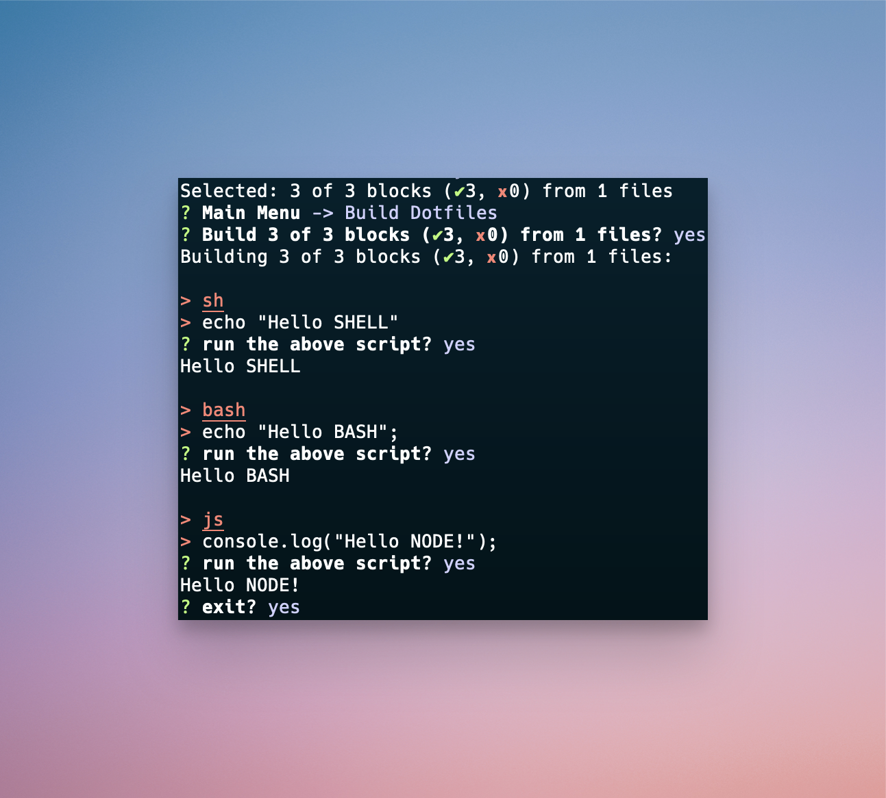

# A Dotfiles Demo

> A working demo of markdown-managed dotfiles.

## Context

### Contents

```md title="demo contents" disabled=true
- `.env` (optional) set key-value pairs for replacement
- `**/*.md` dotfiles stored as markdown
```

### Usage

The CLI builds `action=symlink` codeblocks to the current working directory (`${process.cwd()}/build/links`) and any `action=build` codeblocks missing a file target. For a basic non-interactive demo:

```sh title="demo usage" disabled=true
# From the repo
cd demo/
# Run the tool (select this file and the blocks you want to view)
npx dotfiles-md
# Observe the resulting files
ls -al ./build
```

## The Dotfiles
> **tip**: View the raw markdown file to see the metadata on each codeblock

A codeblock without an `action=*` annotation will do nothing

```md
_sometimes you don't want to run a code block_
```

### Build Actions
The basic build action converts codeblocks to files:

```md build/readme-built.md action=build title="Demo: build action"
> source: README.md, code block #2

How cool is this?

- the data source is a markdown block in src/in.md
- it's built automatically and placed wherever you define in the opening tag
```

### Symlink Actions

The `action=symlink` file will convert codeblocks to a file in `/build/*` and symlink it to the specified location. Naturally, you can use the home directory reference in the file destination: `md ~/demo-symlink.md action=symlink`

```md build/readme-symlink.md action=symlink title="Demo: symlink action (local)"
> source: README.md, code block #3
```

This example creates a file in your home directory `~/global-symlink.md` symlinked to `../build/#-global-symlink.md`

```md $HOME/dotfiles-md-demo.md action=symlink title="Demo: symlink action (GLOBAL)"
Hello world!
```

### Run Actions

The `action=run` flag will run the codeblock according to the appropriate interpreter. These code blocks do not use the `filePath` metadata.



#### Bash
```bash title="run a bash script" action=run
echo "Hello BASH";
```

#### Node
```js title="run a node script" action=run
console.log("Hello NODE!");
```

#### Shell

```sh title="run a shell script" action=run
echo "Hello SHELL"
```

#### ZSH

```sh title="run a zsh script" action=run
echo "Hello SHELL"
```

### TODO: replace with `./.env` matches

All blocks will support replacements from your own `.env` file

```js ../out/hello-world.js action=build title=find-replace-demo disabled=true
// source: hello world.md
console.log("hello world", "%S3_BUCKET");
```
