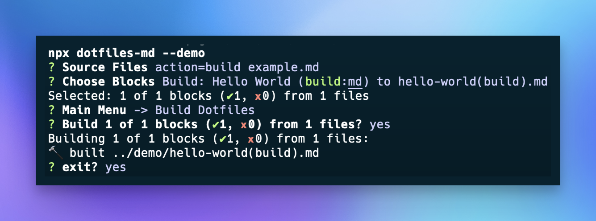

# Run Actions

The `action=run` flag executes the codeblock with an interpreter appropriate to the syntax of the code block. These code blocks do not use the `filePath` metadata.

_for an up-to-date list of available interpreters, consult the `API.ts` codebase._



## Bash
```bash title="Hello World from bash" action=run
echo "Hello BASH";
```

## Node
```js title="Hello World from NodeJS" action=run
console.log("Hello NODE!");
```

## Shell

```sh title="Hello World from shell" action=run
echo "Hello SHELL"
```

## ZSH

```zsh title="Hello World from zsh" action=run
echo "Hello SHELL"
```
