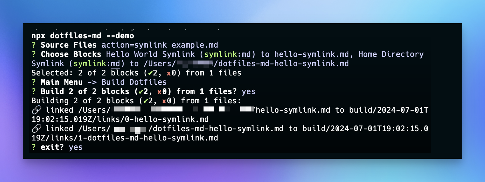

# Symlink Actions

The `action=symlink` file will creates a file in `/build/{timestamp}/` for the code block and creates a symlink at the specified specified location.

> You can use `$HOME` to refer to the home directory as in `$HOME/.gitconfig` for your global git config.



## Hello World Symlink (outputs `hello-symlink.md` where it was run)

```md hello-symlink.md action=symlink title="Hello World Symlink"
> source: demo/action=symlink example.md https://www.npmjs.com/package/dotfiles-md?activeTab=code

# Hello Symlink!

As a result of action=symlink, the contents of this file lives in a build directory (relative to where you ran `dotfiles-md`), and a symlink was created in the specified location.
```

## Home Directory Hello Symlink (outputs `hello-symlink.md` where it was run)

This example creates a file in your home directory `~/dotfiles-md-hello-symlink.md` symlinked to `./build/{#}-dotfiles-md-hello-symlink.md` (a file counter is used to dedupe potential naming conflicts).

```md $HOME/dotfiles-md-hello-symlink.md action=symlink title="Home Directory Symlink"
> source: demo/action=symlink example.md https://www.npmjs.com/package/dotfiles-md?activeTab=code

# Hello Symlink – Home Directory!

As a result of action=symlink, the contents of this file lives in a build directory (relative to where you ran `dotfiles-md`), and a symlink was created in the specified location (`$HOME/dotfiles-md-hello-symlink.md`).
```
